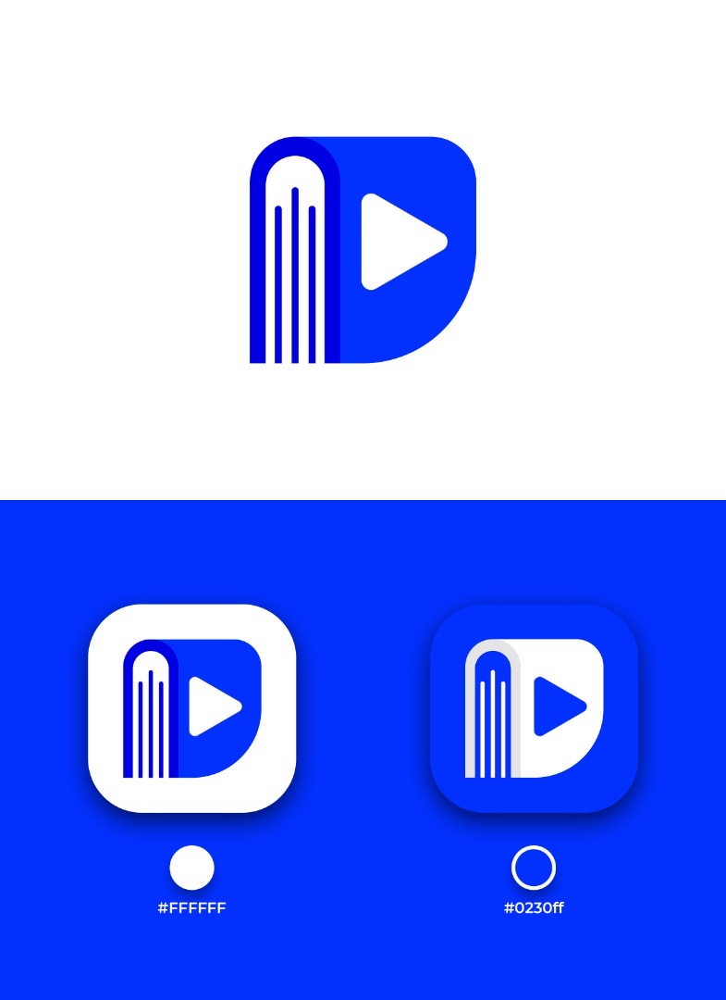
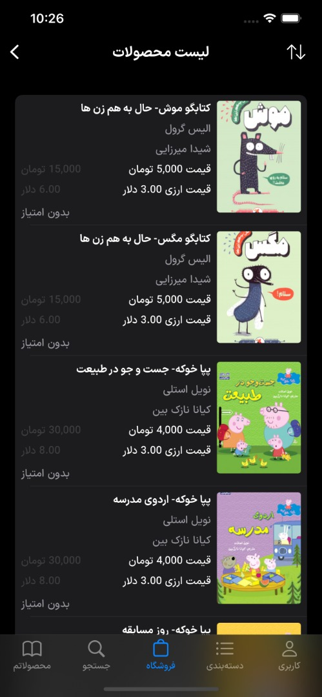
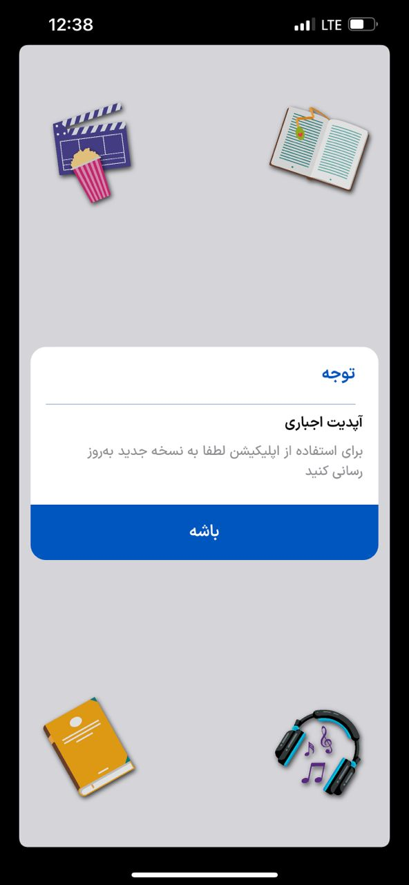
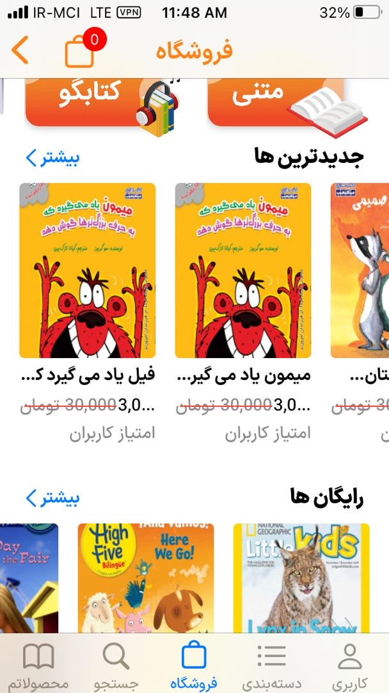
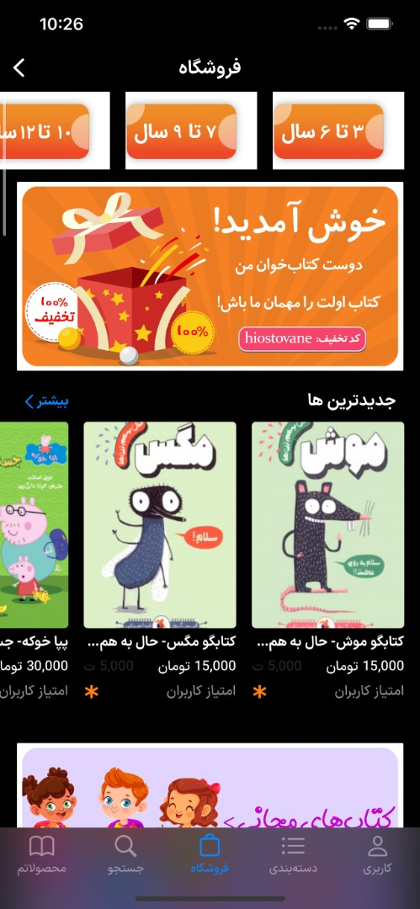
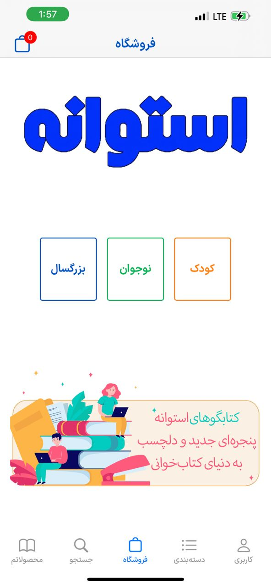
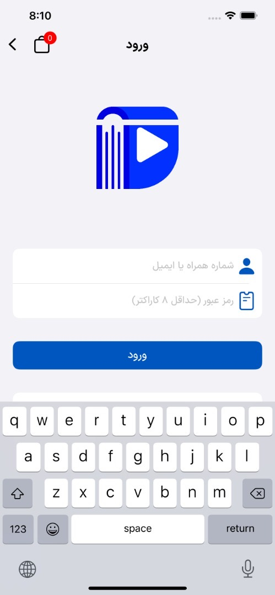
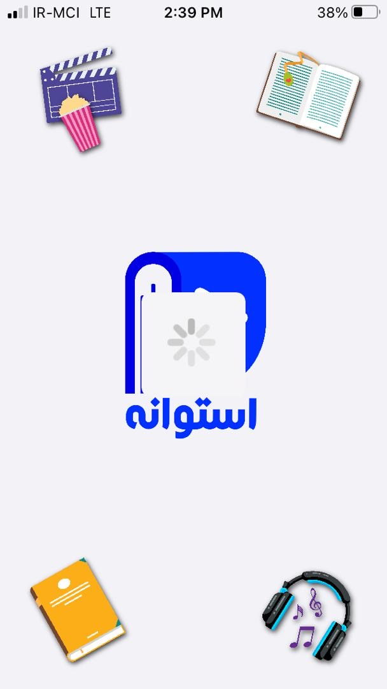

# 📚 Ostovaneh - Secure Multimedia Library

## 🏆 Overview
Ostovaneh is a cross-platform multimedia library application that allows users to access encrypted 📖 audio books, 📹 video content, and 📜 text-based books. This application ensures secure content delivery by encrypting 🔒 data on the server-side and decrypting it within the application upon retrieval via API requests.

## 🚀 Key Features
- 📕 **Multi-Format Library**: Supports audio books, video content, and text-based books.
- 🔐 **End-to-End Encryption**: All content is encrypted on the server and securely transmitted to the application.
- 📺 **Secure Video Streaming**: Videos are delivered in a buffered and encrypted format to prevent unauthorized access.
- 📱 **Cross-Platform Availability**: Available on iOS, Android, and backend powered by Node.js.
- ⚡ **Optimized Performance**: Uses efficient data transmission techniques to ensure seamless playback and reading experience.
- 🏗 **User-Friendly Interface**: Intuitive navigation and easy content access.
- 🔗 **Seamless API Integration**: Secure API requests handle encrypted content transmission and decryption.

## 🛠 Technology Stack
- 🍏 **iOS**: Developed using Swift and Xcode.
- 🤖 **Android**: Developed using JavaScript.
- 🖥 **Backend**: Powered by Node.js for API management and content encryption.
- 🔒 **Security**: Utilizes advanced encryption techniques for content security and API communication.

## 🔄 How It Works
1. **🔏 Encryption on the Server**: All multimedia content (audio, video, and text) is encrypted before being stored on the server.
2. **📡 API-Based Content Delivery**: The application fetches the encrypted content through secure API calls.
3. **🛠 Decryption in the App**: The content is decrypted within the application before being presented to users.
4. **🎥 Buffer-Based Streaming**: Videos are streamed in encrypted chunks, ensuring data security even during playback.

## 🖼 Screenshots
Here are some preview images of the application:

## 📥 iOS App Download
You can download the iOS version of the app using the link below:
[⬇️ Download iOS App](https://sibirani.com/apps/Ostovaneh/)

## 📞 Contact & Support
For inquiries, support, or feedback, please reach out via our official contact channels.